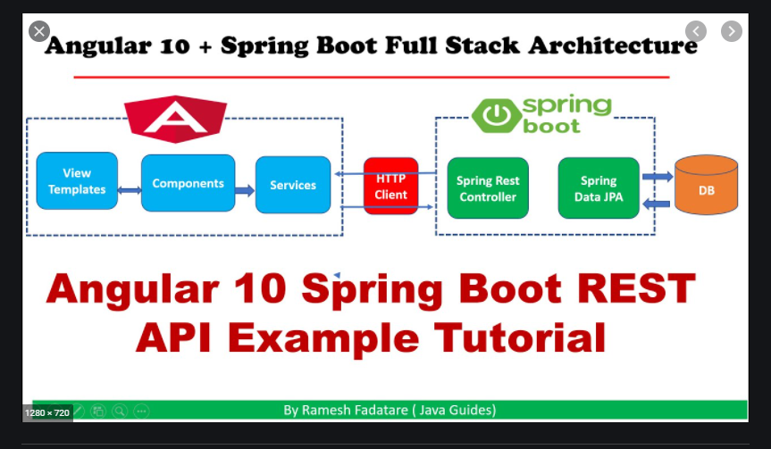

# :zap: Spring Java Angular Interface

* Angular client with Java Spring boot back-end used to display simple list of users

**\* Note: to open web links in a new window use: _ctrl+click on link_**

## :page_facing_up: Table of contents

* [General info](#general-info)
* [Screenshots](#screenshots)
* [Technologies](#technologies)
* [Setup](#setup)
* [Features](#features)
* [Status](#status)
* [Inspiration](#inspiration)
* [Contact](#contact)

## General info

* Displays Java back end user data in a front end Angular list.

## Technologies

* [Angular framework v11](https://angular.io/)
* [Spring Java Tools v4](https://spring.io/tools)

## Setup

* Backend: change directory to `/springboot-backend` and run java code
* Frontend: run `ng serve` from `/angular-frontend`

## Code Examples

* `UserController` class to get a list of all users

```java
public class UserController {

	@Autowired
	private UserRepository userRepository;
	
	@GetMapping("users")
	public List<User> getUsers() {
		return this.userRepository.findAll();
	}
	
}
```

## Features

* Backend java user data passed to frontend

## Status

* Status: Working
* To-Do: Nothing

## Inspiration

* [Youtube: Angular + Spring Boot REST API Example Tutorial | Java Guides](https://www.youtube.com/watch?v=_rMAnZIcRiU&t=3s)

## Screenshots



## Contact

* Repository created by [ABateman](https://www.andrewbateman.org) - you are welcome to [send me a message](https://andrewbateman.org/contact)
